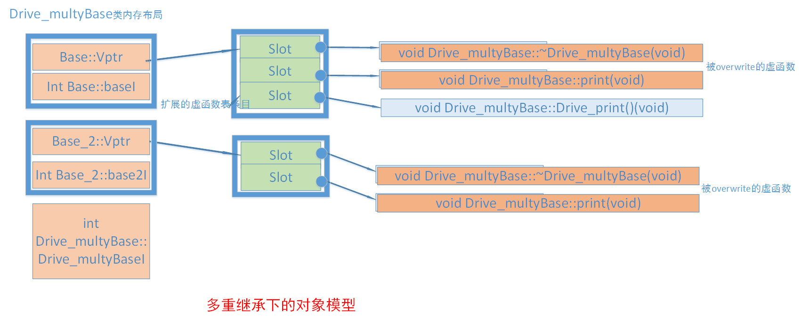

# 什么是对象模型
- 语言中直接支持面向对象的程序设计部分
- 对各种底层（虚指针、虚表）技术的实现机制

本文重点介绍C++对象在内存中的布局。
<!--more-->
# 理解虚函数表
虚函数的作用是为了实现多态（polymorphism）机制。（多态，指**父类可以有多种形态**，指向**某个子类对象**以调用对应的子类函数，而非父类函数）
通过虚函数实现的是动态多态，是指在运行期间才知道真正类型的一种多态机制。
函数重载可以理解为静态多态。**仅返回值无法重载**

当一个类定义了虚函数，或其父类定义了虚函数，编译器会为该类添加一个虚函数指针（vfptr），一般在内存的第一个字节-可以高效找到虚函数表。
**虚函数表存在程序只读数据段（.rodata section）**

# 对象模型展示
## 对象中存在的数据成员如下:

# 对象模型
## 成员函数
### static function
### nonstatic function
### virtual function
## 数据成员
### static member data
### nonstatic member data


## 简单对象模型（可忽略）
所有的成员占用相同的空间（跟成员类型无关），对象只是维护了一个包含成员指针的一个表。表中放的是成员的地址，无论是成员变量还是函数，都是同样处理。对象并没有直接保存成员而只是保存了成员的指针。
## 表格驱动模型（可忽略）
这个模型在简单对象的基础上又添加了一个间接层。将函数和数据分别存储在两个表中，并保存了两个指向表格的指针。这个模型可以保证所有的对象具有相同的大小，比如简单对象模型还与成员的个数有关。其中数据成员表中包含实际数据；函数成员表中包含实际函数的地址（与数据成员相比，多一次寻址）。
## C++对象模型
### 非继承
基类代码展示：
```cpp
class Base
{
public:
 
    Base(int i) :baseI(i){};
  
    int getI(){ return baseI; }
 
    static void countI(){};
 
    virtual ~Base(){}

    virtual void print(void){ cout << "Base::print()"; }

private:
 
    int baseI;
 
    static int baseS;
};

```

**模型图：**


### 单继承
对于一般继承，子类重写父类虚函数则覆盖父类虚函数，子类中新增的虚函数则扩充到虚函数表最后
代码展示：
```cpp
class Derive : public Base
{
public:
    Derive(int d) : Base(1000), DeriveI(d){};
    virtual void print(void) {cout << "Derive:Derive_print()";}

    virtual void Derive_print(){cout<<"Derive_print()";}
    virtual ~Derive(){}
private:
    int DeriveI;
}
```
**模型图：**


### 多继承（非菱形）
存在多个继承是有如下特性：
- 子类的虚函数被放在声明的第一个基类的虚函数表中
- override时，所有的基类的print()函数都被子类的print()覆盖
- 内存布局中，父类按照声明顺序排列
- 其他特性同单继承

代码展示：
```cpp
class Base
{
public:
 
    Base(int i) :baseI(i){};
    virtual ~Base(){}
 
    int getI(){ return baseI; }
 
    static void countI(){};
 
    virtual void print(void){ cout << "Base::print()"; }
 
private:
 
    int baseI;
 
    static int baseS;
};
class Base_2
{
public:
    Base_2(int i) :base2I(i){};

    virtual ~Base_2(){}

    int getI(){ return base2I; }

    static void countI(){};

    virtual void print(void){ cout << "Base_2::print()"; }
 
private:
 
    int base2I;
 
    static int base2S;
};
 
class Drive_multyBase :public Base, public Base_2
{
public:

    Drive_multyBase(int d) :Base(1000), Base_2(2000) ,Drive_multyBaseI(d){};
 
    virtual void print(void){ cout << "Drive_multyBase::print" ; }
 
    virtual void Drive_print(){ cout << "Drive_multyBase::Drive_print" ; }
 
private:
    int Drive_multyBaseI;
};

```
**模型图：**


### 菱形继承
菱形继承也叫钻石继承或重复继承，指基类被某个派生类简单重复的继承了多次。这种情况会有多份基类实例的问题。
代码展示：
```cpp
class B
 
{
 
public:
 
    int ib;
 
public:
 
    B(int i=1) :ib(i){}
 
    virtual void f() { cout << "B::f()" << endl; }
 
    virtual void Bf() { cout << "B::Bf()" << endl; }
 
};
 
class B1 : public B
 
{
 
public:
 
    int ib1;
 
public:
 
    B1(int i = 100 ) :ib1(i) {}
 
    virtual void f() { cout << "B1::f()" << endl; }
 
    virtual void f1() { cout << "B1::f1()" << endl; }
 
    virtual void Bf1() { cout << "B1::Bf1()" << endl; }
 
 
 
};
 
class B2 : public B
 
{
 
public:
 
    int ib2;
 
public:
 
    B2(int i = 1000) :ib2(i) {}
 
    virtual void f() { cout << "B2::f()" << endl; }
 
    virtual void f2() { cout << "B2::f2()" << endl; }
 
    virtual void Bf2() { cout << "B2::Bf2()" << endl; }
 
};
 
 
class D : public B1, public B2
 
{
 
public:
 
    int id;
 
 
 
public:
 
    D(int i= 10000) :id(i){}
 
    virtual void f() { cout << "D::f()" << endl; }
 
    virtual void f1() { cout << "D::f1()" << endl; }
 
    virtual void f2() { cout << "D::f2()" << endl; }
 
    virtual void Df() { cout << "D::Df()" << endl; }
 
};

```
**继承层次：**

**模型图：**

不难看出上面的内存布局模型图中。D类对象含有两个B类数据成员id，分别来自B1、B2类。**不仅增大了空间，还会导致二义性错误**
为解决这个问题。我们需要使用虚继承机制。
### 虚继承
虚继承解决了菱形继承中的多个间接父类实例的问题，主要特性如下：
- 虚继承的子类，如何本身定义了新的虚函数，则编译器为其生成一个虚函数指针（vptr）以及一张虚函数表。
- 虚继承的子类也单独保留了父类的vptr和虚函数表。与子类的内容由一个四字节的全0来分界。
- 虚继承的子类中有一个四字节的虚表指针（vbptr）。
- 虚继承子类override部分，在父类中也会被覆盖。

通过虚继承类的子类会生成一个隐藏的虚基类指针（vbptr），MSVC中。子类存在虚函数则vbptr位于4字节偏移出。
#### 简单虚继承
**模型图：**

图中没有父类的偏移地址，实际是存在的，位于12字节偏移处。

#### 菱形虚继承
**模型图：**


## RTTI
run time type indentification， 运行时类型识别。可以使用基类指针获取实际的派生类类型。只在有虚函数的对象中存在。
c++ 提供两个运算符
dynamic_cast 、 typeid 来进行RTTI操作。
typeid使用结合虚函数表访问-1.
```cpp
#include <typeinfo>
  // 其余代码同前面
  // 获得type_info对象的指针，并调用其name成员函数
  cout << "\t[-1]: "
       << ((type_info *)(vptr1[-1]))->name()
       << " "
       << typeid(base).name()
       << endl;
```
dynamic_case转型操作
```cpp
//其余代码同上
Base *d = new Derive();
// 向下转型，判断是否转型成功
// d 要有虚函数，否则会编译出错
Derive* dd = dynamic_cast<Derive *>(d);
if(NULL != dd)
{
  dd->g();
}
```

## 对象访问流程
在C++中，访问一个对象的虚函数或虚基类成员时，涉及到虚函数指针（Virtual Function Pointer, VFPtr）和虚基类指针（Virtual Base Class Pointer, VBPtr）的访问流程大致如下：

### 虚函数指针（VFPtr）访问流程：
**对象布局：**
对象内部包含一个隐藏的虚函数指针（VFPtr），通常位于对象内存的起始位置。每个含有虚函数的类至少有一个VFPtr，用于指向类的虚函数表（VTable）。
**虚函数表（VTable）：**
VTable是一个结构化的数组，其中每个元素是一个函数指针，对应于类中声明的一个虚函数。VTable按照虚函数在类中声明的顺序排列。
**调用虚函数：**
当通过对象指针或引用调用虚函数时： a. 访问对象的VFPtr，获取指向VTable的指针。 b. 在VTable中查找对应的虚函数索引（根据函数签名确定）。 c. 通过索引取得实际的函数指针。 d. 调用该函数指针，执行虚函数的正确版本（可能是基类的，也可能是派生类重写的）。
虚基类指针（VBPtr）访问流程（仅在存在虚基类时）：

### 虚基类引入：
当一个类通过虚继承从某个基类派生时，这个基类称为虚基类。虚继承旨在解决多继承时的二义性和重复继承问题。
**对象布局：**
含有虚基类的对象内部除了VFPtr外，还有一个或多个VBPtr。每个VBPtr指向一个虚基类表（VBTable），用于管理虚基类在对象内存中的偏移。
**虚基类表（VBTable）：**
VBTable是一个结构化的数组，其中每个元素是虚基类在对象内存中的偏移量。当存在多个虚基类时，可能会有多个VBPtr和相应的VBTables。
**访问虚基类成员：**
当通过对象指针或引用访问虚基类的成员时： a. 访问对象的VBPtr，获取指向VBTable的指针。 b. 在VBTable中查找对应虚基类的偏移量。 c. 根据偏移量加上对象的起始地址，定位到虚基类在对象内存中的实际位置。 d. 通过计算出的地址访问虚基类的成员（包括数据成员和非虚函数）。

## 一些问题的解答
### C++带来的布局成本有多大？
不考虑虚函数和虚继承，c++和c结构体在对象大小和内存布局上是一致的。

### 空类构成的继承层次中，类的大小是多少？
32位机器中。指针的大小和cpu位数相关。32
class B{}; 1字节
class B1 :public virtual  B{}; 4字节 vfptr
class B2 :public virtual  B{}; 4字节 vfptr
class D : public B1, public B2{}; 8字节 vfptr、vbptr

### 为什么构造函数不可以是虚函数？
虚函数定义需要有虚函数指针，构造函数创建对象才有生成虚函数指针。

## 为什么析构函数设为虚函数是有必要的？
多态情况下，派生类的析构函数需要被区分调用。

## 安全性问题
### 访问私有或受保护的虚函数
如果父类的虚函数是private或是protected的，但这些非public的虚函数同样会存在于虚函数表中。所以，我们同样可以使用访问虚函数表的方式来访问这些non-public的虚函数，这是很容易做到的。
```cpp
class Base {
private:
    virtual void f() { cout << "Base::f" << endl; }
};

class Derive : public Base{
};
typedef void(*Fun)(void);
void main() {
    Derive d;
    Fun pFun = (Fun)*((int*)*(int*)(&d) + 0);
    pFun();
    getchar();
}
```
### 父类指针可以访问子类重载的私有虚函数
### 不重新定义继承而来的缺省参数值
```cpp
class B
{
public:
    virtual void fun(int i = 1)
    {
        std::cout << "base fun called, " << i << endl;
    };
};

class D : public B
{
private:
    virtual void fun(int i = 2)
    {
        std::cout << "driver fun called, " << i << endl;
    };
};

int main(int argc, char* argv[])
{
    B* p = new D();
    p->fun();

    return 0;
}
```
这是因为：“virtual 函数系动态绑定， 而缺省参数却是静态绑定”，也就是说在编译的时候已经按照p的静态类型处理其默认参数了,转换成了(*p->vptr[1])(p, 1)这样的方式。

## 如和不是用虚函数实现多态
可以使用函数指针的方式。即c语言实现多态的方案
虚函数表会有一定的性能损失。

>内容参考
>https://www.cnblogs.com/QG-whz/p/4909359.html
>https://www.cnblogs.com/tgycoder/p/5240142.html