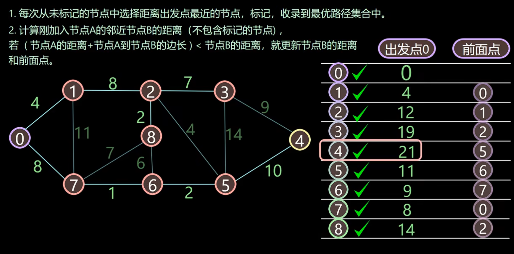

# 什么事dijkstra算法
本质上是一个贪心的算法，不断寻找具体源点最近的没有访问过的节点。
三部曲：
- 选源点到那个节点近且该节点没有被访问过
- 该最近节点被标记访问过
- 更新非访问节点的源点距离
<!--more-->

# 一张图带你看清计算过程


# 代码实现
代码实现上可以使用两点之间的具体来保证不去访问已访问的节点。
```py
import heapq
def dijkstra(graph, start):
    # 初始化距离字典
    distance = {node: float('infinity') for node in graph}
    distance[start] = 0
    print('distance:', distance)

    # 使用优先队列来保存节点和到达该节点的距离
    priority_queue = [(0, start)]
    print('priority_queue:', priority_queue)

    print('graph:', graph)
    while priority_queue:
        current_distance, current_node = heapq.heappop(priority_queue)
        print('priority_queue:', priority_queue)

        # 如果当前节点的距离已经超过之前找到的最短路径，则忽略 -- 保证不会访问已经访问的节点
        if current_distance > distance[current_node]:
            continue

        # 遍历当前节点的邻居
        for neighbor, weight in graph[current_node].items():
            new_distance = current_distance + weight

            # 如果通过当前节点到达邻居节点的路径更短，则更新距离字典并加入优先队列
            if new_distance < distance[neighbor]:
                distance[neighbor] = new_distance
                heapq.heappush(priority_queue, (new_distance, neighbor))
                
        print('priority_queue_new:', priority_queue)

    return distance


# 示例图的邻接表表示
graph = {
    'A': {'B': 5, 'C': 3},
    'B': {'A': 5, 'C': 2, 'D': 1},
    'C': {'A': 3, 'B': 2, 'D': 4, 'E': 2},
    'D': {'B': 1, 'C': 4, 'E': 1, 'F': 7},
    'E': {'C': 2, 'D': 1, 'F': 3},
    'F': {'D': 7, 'E': 3}
}

# 从节点 A 开始计算最短路径
start_node = 'A'
shortest_distances = dijkstra(graph, start_node)
print("从节点 {} 出发到各节点的最短距离:".format(start_node))
for node, distance in shortest_distances.items():
    print("到节点 {}: {}".format(node, distance))

```