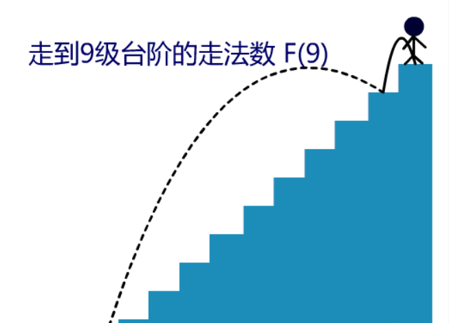
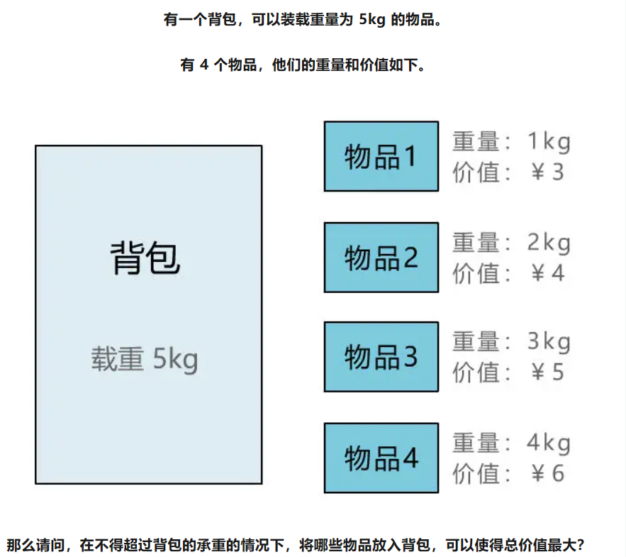
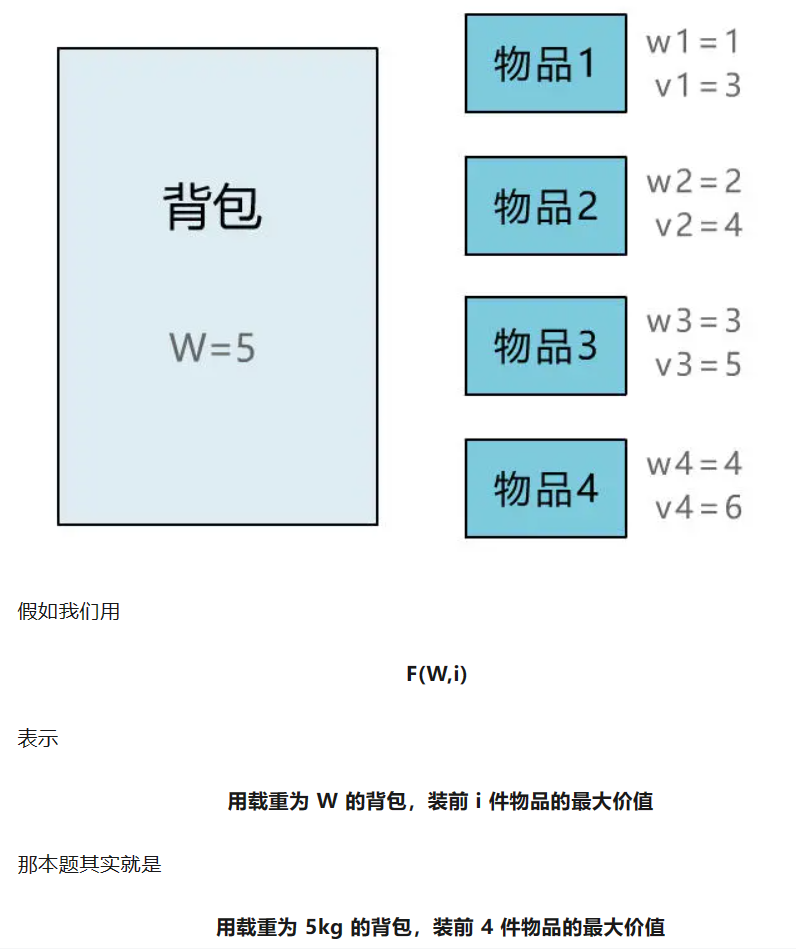
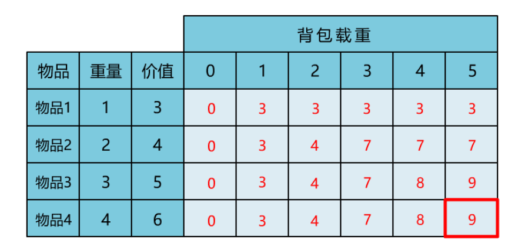

# 什么叫动态规划
动态规划（DP，Dynamic Programming）是一种解决问题的方法，尤其使用于处理哪些可以分解成相互关联小问题的情况。核心思想是避免重复计算，通过保存已解决的子问题答案，逐步解决更大规模问题的最优解。

<!--more-->
# 案例解释
想象你在爬楼梯，楼梯有n阶台阶，每次你可以跨1步或2步。你想知道有多少种不同的方式可以爬到顶层???
我们不用重复数遍所有可能的走法，而是先算出走到前几步有多少种方式，然后利用这些结果组合得出到达更高阶的步数。
比如，先算出走到第1阶和第2阶各有几种方法，然后结合这两个结果得出到第3阶的方法数，以此类推，直至最终目标。

假定10阶台阶分析：
到第10阶台阶前是在第8阶或第九阶：f(10) = f(8) + f(9)

## 动态规划三要素
- 最有子结构： f(x-1), f(x-2)
- 状态转移方程：f(x)=f(x-1)+f(x-2)
- 边界值：f(1)=1, f(2)=2

解决问题代码如下：
```cpp
int getWays(int n)
{
    if (1 == n)
    {
        return 1;
    }
    if (2 == n)
    {
        return 2;
    }

    return getWays(n - 1) + getWays(n - 2);
}
```
时间复杂服O(2^N),可以使用空间换时间的方法来降低时间复杂度。使用遍历的方式而不用递归。


# 难度升级
背包问题：

思考下如何转化三要素：


问题转化： 
当前f(5,4) ：
- 将物品4放入：6+f(1,3)  
- 不放入物品4: f(5,3)
存在两种状态：比较大小max(6+f(1,3), f(5,3))
边界值f(0, n) = 0, f(n, 1) = 最重的一个物品 = 3

根据上边的分析可以得到：
- 转态转移方程：f(w,i) = max(wi+f(w-wi, i-1), f(w,i-1))
- 最右子结构：f(w-wi, i-1), f(w,i-1)
- 边界值：f(0, n) = 0, f(n, 1) = max(wi)

求解表格中的右下角数据：


# 使用python解决上述问题代码如下：
```python
def knapsack_dp(weights, values, capacity):
    # 确保输入的数据长度匹配
    assert len(weights) == len(values)

    # 初始化动态规划表格，行代表物品，列代表背包容量
    n = len(weights)
    dp = [[0 for _ in range(capacity + 1)] for _ in range(n + 1)]

    # 动态规划填充表格
    for i in range(1, n + 1):
        for w in range(1, capacity + 1):
            # 如果当前物品的重量大于背包剩余容量
            if weights[i - 1] > w:
                # 不能装入背包，保留前一件物品时的最大价值
                dp[i][w] = dp[i - 1][w]
            else:
                # 可以选择装入或不装入当前物品
                dp[i][w] = max(dp[i - 1][w], dp[i - 1][w - weights[i - 1]] + values[i - 1])

    # 返回背包内所能容纳物品的最大价值
    return dp[n][capacity]

# 示例用法
weights = [1, 2, 3, 4]  # 物品重量列表
values = [3, 4, 5, 6]    # 物品价值列表
capacity = 5             # 背包容量
""" f(capacity, len(weights)) = 
max
(
    weights[len(weights)]+f(capacity-weights[len(weights)], len(weights)-1),
    f(capacity, len(weights)-1)
)
"""

max_value = knapsack_dp(weights, values, capacity)
print(f"背包内所能容纳物品的最大价值是: {max_value}")
```
代码核心公式：
f(capacity, len(weights)) = 
max
(
weights[len(weights)]+f(capacity-weights[len(weights)], len(weights)-1),
f(capacity, len(weights)-1)
)
