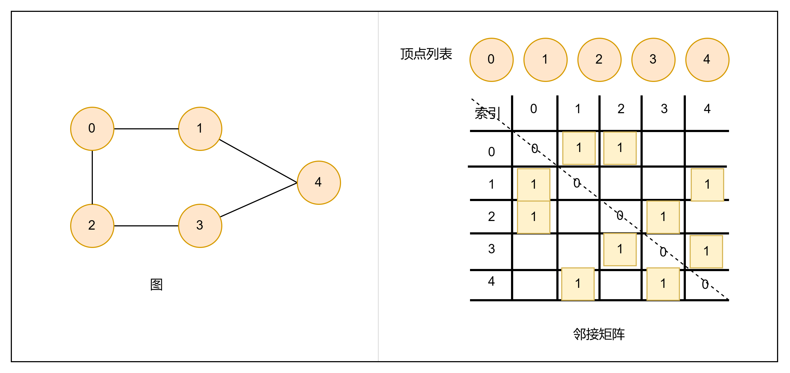

# 什么是图
图（graph）是一种非线性的数据结构，由顶点（vertex）和边（edge）组成。
顶点和边的集合：
V ={1,2,3,4,5}
E = {(1,2), (1,3), (2,5), (3,4), (4,5)}
转换数学模型：
G = {V, E}

相较于线性关系（链表）和分治关系（树），网络关系（图）的自由度更高，因此也更复杂。
<!--more-->
# 图的常见类型和术语
## 常见类型
无向图（undirected graph）
有向图（directed graph）
连通图（connected graph）
非连通图（disconnected graph）
有权图（weighted graph）

## 常用术语
邻接（adjacency）：当顶点之前存在边相连，则称这两顶点邻接
路径（path）：从顶点1到顶点5所经过的边构成序列被称为从1到5的路径
度（degree）：一个顶点拥有的边数。针对有向图，还存在in-degree多少边指向该点，out-degree多少边从该点指出。

# 图的表示
## 邻接矩阵
设图的顶点数量为n，邻接矩阵（adjacency matrix）使用nxn大小的矩阵来表示图，每一行代表一个顶点，矩阵元素代表边，用1或0表示顶点是否存在边。

邻接矩阵特性：
- 顶点不能与自身相连，因此邻接矩阵的对角线元素没有意义
- 对于无向图，两个方向等价，此时邻接矩阵关于主对角线对称
- 将邻接矩阵的元素由1或0替换为权重，则可表示有权图
使用邻接矩阵，我们可以直接访问矩阵元素获取边，因此增删改查效率高，时间复杂度O(1), 但空间复杂度较高O(n^2)。
## 邻接表
邻接表（adjacency list）使用n个链表表示图，链表节点表示顶点。第i个链表表示第i个节点，其中存储了该顶点的所有邻接顶点（与该顶点相连的顶点）。

邻接表存储空间只存实际存在的边，远小于n^2。空间小，但需要通过遍历链表查找，时间效率不如邻接矩阵。
可以将邻接表类比哈希表，实现优化。链表转为AVL树或红黑树，时间复杂度由O(n)->O(logn);还可以直接转为哈希表，将时间复杂度降低到O(1)。

# 图的一般应用
许多现实问题可以使用图建模，和通过图计算解决相应问题
|现实场景|顶点|边|图计算问题|
|--------|---|--|---------|
|社交网络|用户|好友关系|潜在好友推荐|
|地铁线路|站点|站点间的连通|最短路线推荐|
|互联网|路由节点|路由之间的连接|最对路由路径推荐|

>内容参考
>https://www.hello-algo.com/chapter_graph/graph/#2