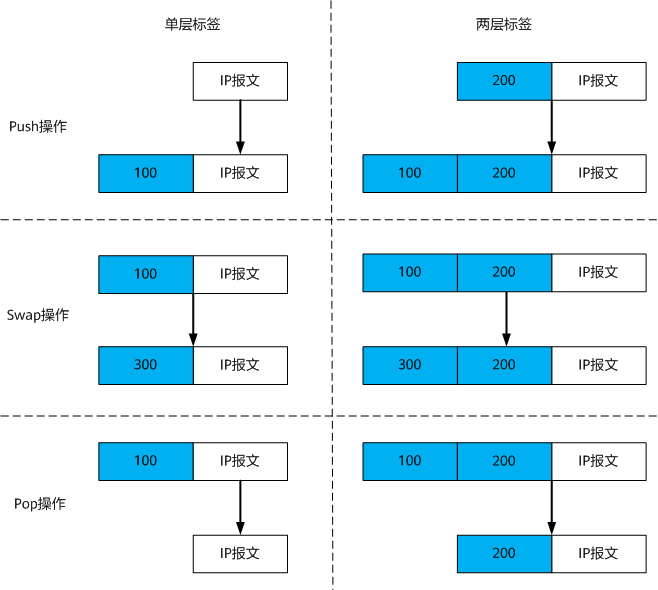
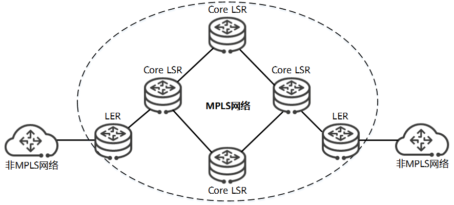
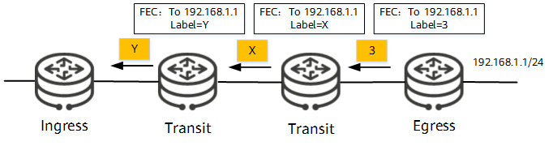
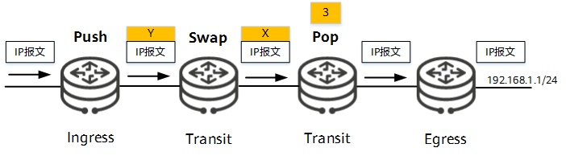
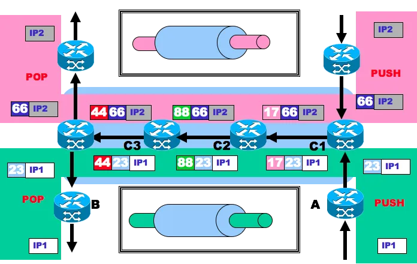
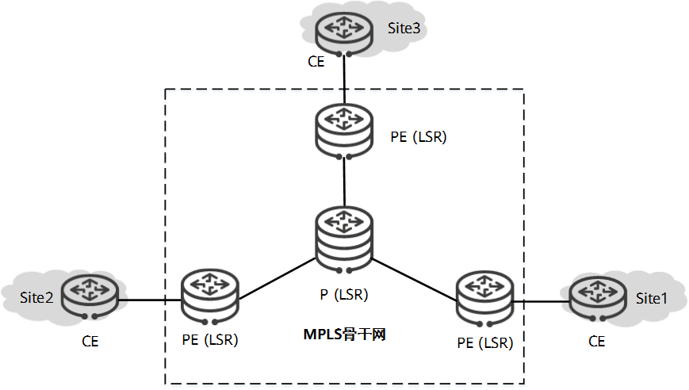

# 什么是MPLS
**MPLS是一种在骨干网上利用标签来指导数据报文高速转发的协议**，相对于传统ip路由方式，提供了一种新的网络交换方式，**它将ip地址映射为简短且长度固定、只具有本地意义的标签，以标签交换替代ip查表，从而显著提升转发效率**。同时该标签机制可以再ip网络中构筑逻辑上的隧道，因此可以为各种L2VPN、L3VPN及EVPN等业务提供公共隧道服务。

# 为什么需要MPLS
起初硬件技术限制，基于最长匹配算法的IP技术必须使用软件方法查找路由，转发性能低下。**MPLS最初就是为了提升IP网络中路由设备的转发速率**。

通过两种方式提升转发速率:
|MPLS方式|IP路由方式|
|------|------|
|简洁的标签交换|庞大的路由表|
|中间节点无需解析IP报文头|每个节点都需要解析|

后来，随着ASIC(Application Specific Intergrated Circuit, 专用集成电路)技术的发展，ip路由使用硬件来查表了，mpls不再具备优势。

但是，MPLS的本质是一种隧道技术，天然可以充当多个业务的公网隧道。且MPLS依靠固定的标签交换路径，是一种面向连接的转发技术，使得其在流量工程(Traffic Engineering, TE)、Qos等领域也有广泛应用。

# MPLS有哪些特征
## 基本概念
### FEC
MPLS是一种分类转发技术，相同转发处理方式的数据分组归为一类，称为FEC(Forwarding Equivalence Class, 转发等价类)。
划分灵活，可以是源地址、目的地址、源端口、目的端口、协议种类、业务类型等要素的任意组合。例如，在采用最长匹配算法的IP路由转发中，去往同一个目的地址的所有报文就是一个FEC。

### MPLS标签
MPLS标签是一个简短且长度固定的标识符，只具有本地意义，用于唯一标识一个分组所属的FEC。

*？？在某些情况下（负载分担）对应一个FEC可能会有多个MPLS标签，但一台设备上，一个MPLS只能代表一个FEC。*

MPLS封装结构，长度4字节：
|0~19|20~22|23|24~31|
|--------------------|---|-|--------|
|Label|TC|Bos|TTL|

- Label: 20bit，标签值域
- TC(Traffic Class): 3bit，原Exp，用于扩展。现在通常用来做Qos and ECN
- BoS(Bottom of stack): 1bit, 栈底标识。MPLS支持多层标签，即标签嵌套。BoS值为1时表明为最底层标签。
- TTL: 8bit Time to Live (最大跳数)。

### 标签操作
MPLS标签位于链路层和网络层之间，支持多层标签（标签栈），**靠近链路层的标签是栈顶标签**（外层标签），靠近网络层的标签是栈底标签（内层标签），处理方式和栈一样，后进先出(Last in First out)。

### LSP
LSP(Label Switched Path, 标签交换路径)是指属于同一FEC的报文在MPLS域内转发所经过的路径。
- 起始节点称为入节点(Ingress),一条LSP只能有一个Ingress，压入新的MPLS标签，封装成MPLS报文。
- 中间节点(Transit)，通过查标签转发信息表，完成转发。
- 末尾节点称为出节点(Egress)，弹出标签，恢复为原来的报文进行转发。

## MPLS网络是怎么样的

- LSR(Label Switching Router，标签交换路由器)，基本组成单元。相邻点都运行MPLS则节点为Core LSR。
- LER(Label Edge Router,标签边缘路由器),相邻节点存在不运行MPLS的LSR称为LER。

## MPLS有什么价值
- MPLS完全兼容IP网络，相当于在IP网络的基础上进行改进，建设成本低，易于推广。
- MPLS的转发和控制平面是分离的，是面向连接的，可以有效实施流量工程和Qos。
  - 控制平面依靠IP路由建立LSP
  - 转发平面通过LSP传输报文
- MPLS是一种与链路层无关的协议，位于2.5层。可以同时支持帧中继、ATM、PPP和SDH等协议，保证多中网络的互通，兼容性好。
- MPLS网络支持层次化的拓扑结构，适合在IP骨干网中部署
- MPLS标签栈支持无限嵌套，正好契合了VPN业务对公私网标签多层封装的要求。

# MPLS是如何工作的
## MPLS如何建立LSP
MPLS标签由下游分配，按照从下游到上游方向进行分发。

LSP建立方式分为两种：
- 静态LSP：手工按照上游出等于下游入的规则。
- 动态LSP：依赖原IP路由，支持多种协议：
  - LDP(Label Distribution Protocol)
  - RSVP-TE(Resource Reservation Protocol Traffic Engineering)
  - MP-BGP(Multiprotocol Border Gateway Protocol)
  
## 报文如何通过LSP转发
### 单标签如何转发

### 多标签如何转发

对于IP1的报文来说，上层LSP就是由A->B组成。但是A并非直接转发给B的，而是通过另一个子LSP C1->C2->C3转发给的B。这么做，首先是因为A和B没有直接相连，没有办法直接转发。另一方面，因为IP1和IP2有一部分重合的路径，通过定义子LSP可以复用这部分路径。对于IP1和IP2来说，C1，C2，C3只需要存储一套标签转发表即可。

# 什么是MPLS VPN
MPLS VPN是目前应用最广泛的VPN技术。利用MPLS在IP骨干网上构建VPN。
基本模型有三个角色构成：
- CE(Customer Edge)：用户边缘设备，VPN站点(site)通过CE连接到SP网络。CE感知不到VPN也不需要支持MPLS。
- PE(Provider Edge)：服务提供商网络的边缘设备，与CE相连。在MPLS网络中，作为LSR，对MPLS和VPN的所有处理都在改设备上，性能要求较高。
- P(Provider)：服务提供商的骨干设备。作为LSR设备，只需要处理MPLS，不处理VPN信息。

---

# 深入学习视频推荐
可以看华为的info-Finder中的在线课堂学习相关的网络技术
[MPLS基础](https://download.huawei.com/edownload/e/download.do?actionFlag=download&nid=EDOC1100106398&partNo=6001&mid=SUPE_DOC)
[MPLS-VPN基础-上](https://download.huawei.com/edownload/e/download.do?actionFlag=download&nid=EDOC1100270126&partNo=6001&mid=SUPE_DOC)

>内容参考
>https://info.support.huawei.com/info-finder/encyclopedia/zh/MPLS.html
>https://zhuanlan.zhihu.com/p/27232535

