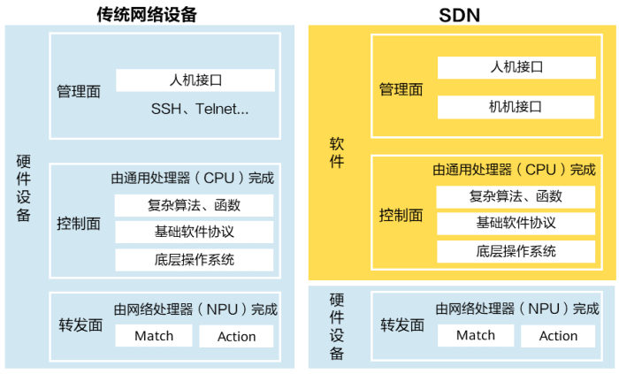
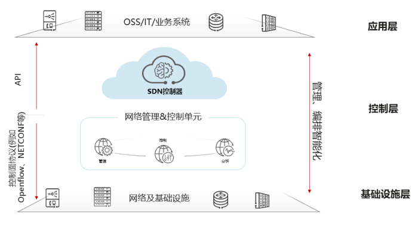
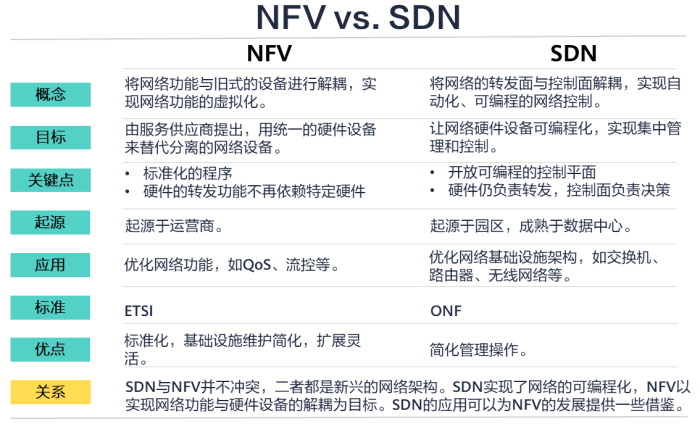

# 什么是SDN
SDN(Software Defined Networking),即软件定义网络，是一种革新的网络架构理念。将传统网络设备（如路由器、交换机）的功能做了分离，让控制平面（决定数据如何在网络中流动的部分）与数据转发平面（实际发送和接收数据的部分）分离 -- **转控分离**。就像给网络安装了大脑，随时控制网络行为，而不需要单独设备的配置。实际网络中SDN允许网络管理员通过软件程序（**动态可编程**）**集中、动态地控制**网络流量，可以根据需求快速建立虚拟网络、分配带宽资源、设定安全策略等。大大提高了网络管理的效率和灵活性。
<!--more-->
# 为什么需要SDN
## 传统网络的局限
传统网络是一个分布式的网络，在二层网络中通过广播方式传递信息。三层网络中通过标准路由协议传递信息。在管理控制层面存在挑战，如**配置复杂度增加、网络变更难度大、整体网络资源利用率不高、无法快速适应网络流量变化**等。
## SDN的技术路线
传统网络与SDN网络架构对比

# SDN架构
SDN可以分为基础设施层、控制层和应用层：
- 基础设施层：主要是转发设备，实现转发功能；
- 控制层：有SDN控制软件组成，可以通过标准协议与转发设备进行通信，实现对基础设施层的控制；
- 应用层：常见的有基于openstack架构的云平台。

SDN使用使用南北向应用程序接口来进行层间通信，南向API负责SDN控制层和基础设施的通信，北向API负责SDN控制层和应用层的通信。
# SDN的优点
当前主流的SDN架构中，保留了传统硬件设备上的操作系统和基础的协议功能，通过控制器收集整个网络中的设备信息，具有如下的优点：
- **网络可编程**
  网络设备提供应用编程接口（API），使得开发人员和管理人员能够通过编程语言向网络设备发送指令。网络工程师可以使用脚本自动化创建和分配任务，收集网络统计信息。将基于CLI和SNMP的封装脚本变为实实在在可编程的对象，提供了更丰富的功能。
- **网络抽象化**
  控制器作为中间层，通过南北向API与网络设备和应用程序进行交互，将底层的硬件设备抽象为虚拟化的资源池，***应用和服务不再与硬件紧密耦合***。
- **降低成本**
  保留了原有的网络设备，硬件设备仍然具备管理、控制、转发的全部能力，方便进行整网的改造，无需进行大规模搬迁。控制器的引入将人工配置转变为机器配置，提升运维效率，降低运维成本。
- **业务灵活调度**
  SDN在没有改变硬件设备整体逻辑的基础上，通过增加开放的南北向接口，实现将计算机语言到配置命令的翻译，使界面式管理、集中管理变成了可能，解决了传统网络业务调度不灵活的问题。
- **集中管理**
  通过控制器来管理底层硬件设备，编排网络业务，分配网络资源和调整流量优先级。管理员可以感知整个网络的状态，及时调整带宽和优化策略。
- **开放性**
  SDN架构支持供应商开发自己的生态系统，开发的API支持云编排、OSS/BSS、SaaS等

# SDN与NFV的区别
NFV（Network functions Virtualization,网络功能虚拟化）。将传统网络功能（防火墙、负载均衡器、路由器、DNS服务器）从专用硬件设备中抽象出来，转而在标准的、基于软件的虚拟化平台上运行，可以极大的提高网络资源的利用率和灵活性。是未来网络的核心技术之一，不断与SDN、云计算、AI等计划融合演进中。、

# SDN的未来与挑战
## 各领域发展前景：
- **在数据中心领域**
大多数大规模数据中心已经采用扁平化架构，这给网络设备的管理带来了极大的挑战。SDN带来的自动化运维、集中管理在数据中心的自动化调配以及扩容中有极大的应用空间。
- **在视频领域**
由于SDN支持数据流的实时调配，使得网络能够承载更多的流量。
- **在机器学习和人工智能领域**
SDN也会受到运营需求和软件创新的影响，提供更丰富、更新潮的网络体验。
- **在未来的网络自动驾驶（ADN）中**
SDN架构也能够发挥重要作用。

## SDN缺点：
SDN并非没有缺点，与其他IT产品一样，SDN存在安全、扩展以及缺乏广泛合作、缺乏生态的问题。
- **集中管理的安全风险**
虽然集中管理十分方便，但这也是一种安全风险。集中管理的单节点被攻击，整个网络可能都会受到影响。
- **SDN控制器的瓶颈**
对于软件完全从硬件上分离的SDN思路来说，控制器的软件开发难度、控制器的计算压力都是巨大的挑战。
- **北向API缺乏统一标准**
缺乏标准的北向API导致供应商提供的接口不统一，应用程序开发困难上升，同一组开发人员必须同时开发与不同控制器的相互操作。
