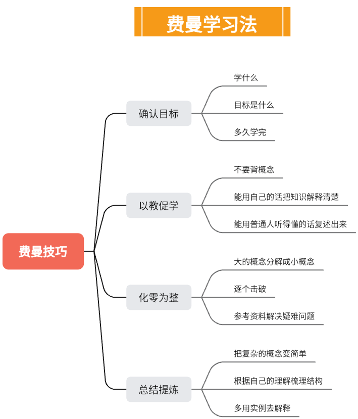
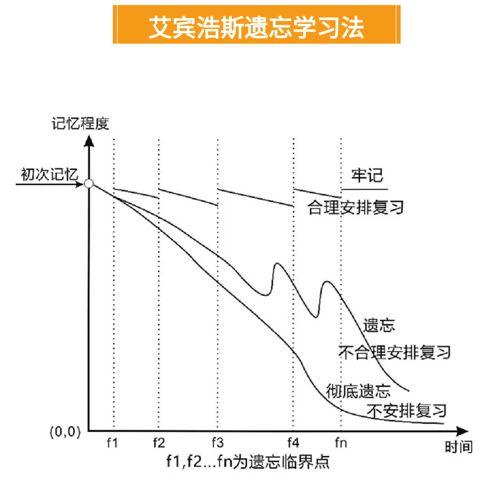

# 好用的用于学习的AI提示词

<!--more-->

## 费曼学习法
请使用费曼学习法，用简单的语言解释（量子力学）是什么，并提供一个简单的例子来说明它如何应用

## 帕累托法则（80/20原则）
将（量子力学）最具挑战的20%核心知识汇总，以涵盖80%的内容，并提供一个专注于掌握这些内容的学习计划

## 波莫多罗技术（番茄工作法）
结合番茄工作法，帮我梳理一个由浅入深的学习计划，学习主题是（量子力学）

## SQ3R方法（Survey-预览， Question-提问， Read-阅读， Recite(复述)，Review(回顾)）
我正在学习（量子力学）,请结合SQ3R方法，整理成表格，以帮我快速掌握知识技能

## 艾宾浩斯遗忘曲线
我正在学习（量子力学）,请结合艾宾浩斯遗忘曲线帮我制定学习计划，让我能过更长时间掌握这个知识技能

## 主题交叉法
创建一个学习计划，将（量子力学）中不同的主题或技能混合起来，帮我全面理解，并促进他们之间的联系

## 双编码理论（同时使用问题和视觉信息）
结合双编码理论，同时使用文字和视觉信息，例如图表、图像、地图等，帮我快速学习、记忆（量子力学）

## GROW模型（一个设定目标和解决问题的框架，Goal-目标， Reality-现状，Options-选择， Will-行动）
我正在学习（量子力学），请结合GROW模型，帮我制定一个符合我的学习计划

## 分块学习（大量信息分解成多个小块逐步学习）
结合分块学习法，将（量子力学）拆分成小块，并搭建知识树，帮我快速掌握

## 多感官学习法
为（量子力学）建议各种学习资源，例如视频，书籍、博客、互动练习等，以迎合不同的学习风格。