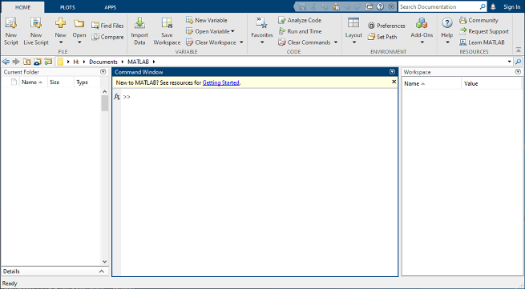
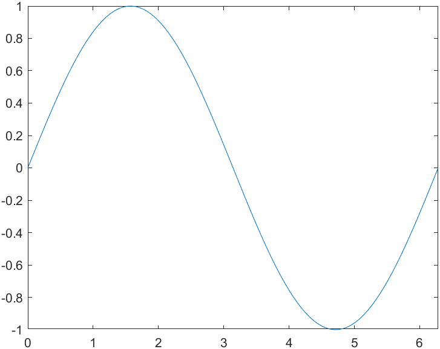
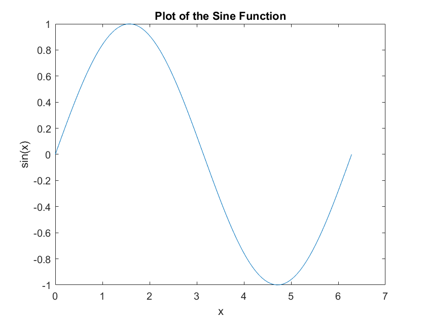
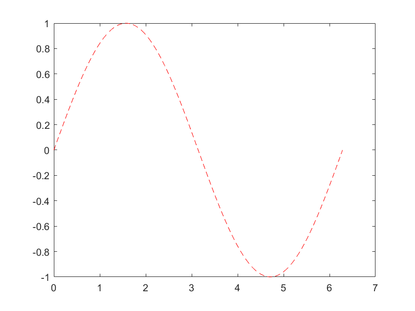
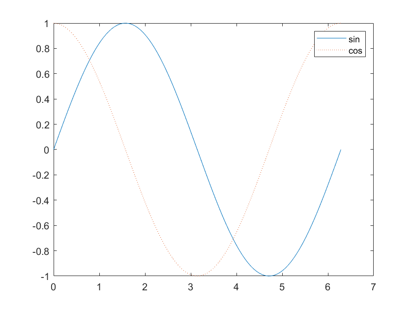
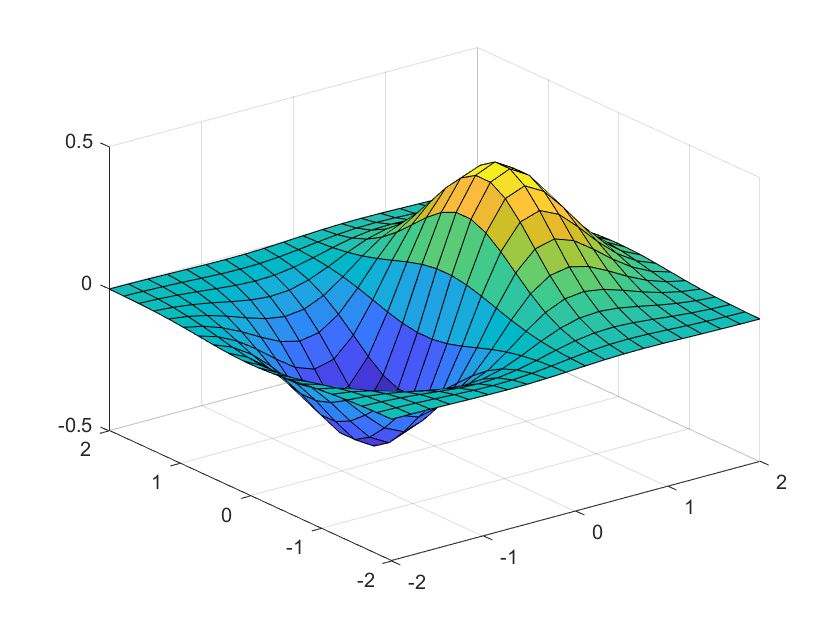
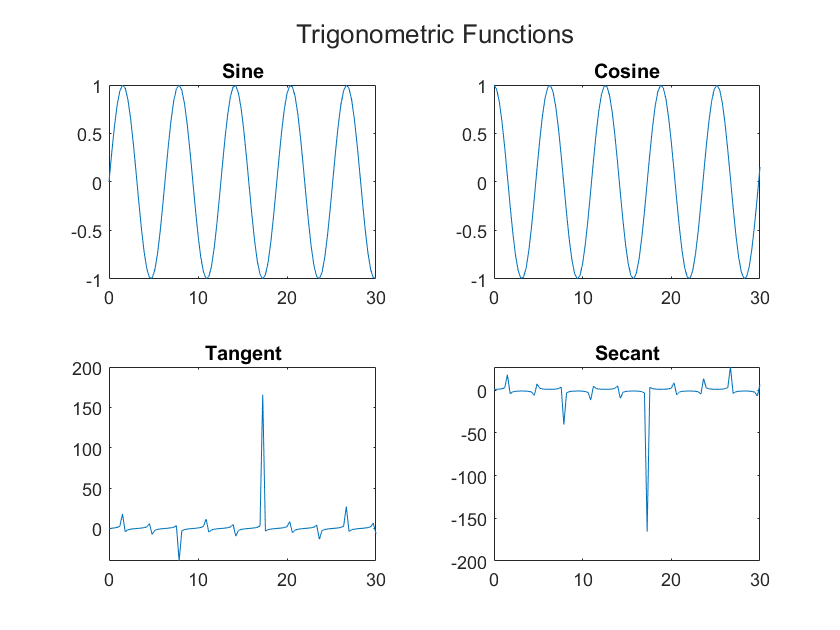

*工具和新技术的学习，我们需要了解它的帮助文档，这很重要。会让你对整个工具在结构上有一个整体的了解。我的总结整理，也是基于这个帮忙文档来做的。[matlab帮助文档](https://ww2.mathworks.cn/help/index.html?s_tid=CRUX_lftnav)*
<!--more-->

# 使用matlab
## matlab 快速入门
### 桌面基础知识
可以通过界面中命令行视图直接输入命令交互，或新建脚本，编写代码运行。


可以直接不用分号结尾，与命令行交互，或使用分号结束，不在命令行窗口显示。
```m
>> a = [1 2]

a =

     1     2

>> a = [1 2];
>> disp(a);
     1     2
```

### 矩阵和数组
Matlab  matrix laboratory 矩阵实验室。
矩阵相关数学基础知识：[线性代数](https://timnf.github.io/2024/03/06/math/math/)
```m
% 使用空格或逗号分隔元素，创建一个单行4列的数组（矩阵）
a = [1 2 3 4]
a = [1, 2, 3, 4]

% 使用分号隔行，以创建多行矩阵， 3行3列矩阵创建
>> a = [1 3 5; 2 4 6; 7 8 10];
>> disp(a);
     1     3     5
     2     4     6
     7     8    10


% 使用一些matlab内置的函数创建矩阵ones、zeros、rand等
>> zeros(5, 2)

ans =

     0     0
     0     0
     0     0
     0     0
     0     0

>> ones(5, 2)

ans =

     1     1
     1     1
     1     1
     1     1
     1     1

>> rand(5, 2)

ans =

    0.5312    0.0986
    0.1088    0.1420
    0.6318    0.1683
    0.1265    0.1962
    0.1343    0.3175
```

#### 矩阵和数组的运算
```m
% matlab允许使用单一运算符或函数来处理矩阵中的所有值
>> a + 10

ans =

    11    13    15
    12    14    16
    17    18    20

% 转置矩阵，使用（'）
>> a'

ans =

     1     2     7
     3     4     8
     5     6    10

% 使用inv函数可以得到逆矩阵。
>> inv(a)

ans =

    4.0000   -5.0000    1.0000
  -11.0000   12.5000   -2.0000
    6.0000   -6.5000    1.0000


% （*）可以执行标准的矩阵乘法。计算行和列之前的内积。例如：矩阵乘其逆矩阵返回单位矩阵。
>> a*inv(a)

ans =

    1.0000    0.0000   -0.0000
         0    1.0000   -0.0000
         0    0.0000    1.0000

% 使用(.*) 是内部元素的乘法，而非矩阵乘法
>> p = a.*a

p =

     1     9    25
     4    16    36
    49    64   100
```
#### 矩阵串联
```m
% 列串联
>> A = [a, a]

A =

     1     3     5     1     3     5
     2     4     6     2     4     6
     7     8    10     7     8    10

% 行串联
>> A = [a; a]

A =

     1     3     5
     2     4     6
     7     8    10
     1     3     5
     2     4     6
     7     8    10
```
### 数组索引
```m
A = [1 2 3 4; 5 6 7 8; 9 10 11 12; 13 14 15 16]
A = 4×4

     1     2     3     4
     5     6     7     8
     9    10    11    12
    13    14    15    16
```
引用数组中的特定元素有两种方法。最常见的方法是指定行和列下标，例如
```m
A(4,2)
ans = 14
```
另一种方法不太常用，但有时非常有用，即使用单一下标按顺序向下遍历每一列。此处需要注意是**列遍历**：
```m
A(8)
ans = 14
```
使用单一下标引用数组中特定元素的方法称为线性索引。

如果尝试在赋值语句右侧引用数组外部元素，MATLAB 会引发错误。
```m
test = A(4,5)
Index in position 2 exceeds array bounds (must not exceed 4).
```
不过，您可以在赋值语句左侧指定当前维外部的元素。数组大小会增大以便容纳新元素。
```m
A(4,5) = 17
A = 4×5

     1     2     3     4     0
     5     6     7     8     0
     9    10    11    12     0
    13    14    15    16    17
```
要引用多个数组元素，请使用冒号运算符，这使您可以指定一个格式为 start:end 的范围。例如，列出 A 前三行及第二列中的元素：
```m
A(1:3,2)
ans = 3×1

     2
     6
    10
```
单独的冒号（没有起始值或结束值）指定该维中的所有元素。例如，选择 A 第三行中的所有列：
```m
A(3,:)
ans = 1×5

     9    10    11    12     0
```
此外，冒号运算符还允许您使用较通用的格式 start:step:end 创建等间距向量值。
```m
B = 0:10:100
B = 1×11

     0    10    20    30    40    50    60    70    80    90   100
```
如果省略中间的步骤（如 start:end 中），MATLAB 会使用默认步长值 1。

### 工作区变量
工作区包含在 MATLAB® 中创建或从数据文件或其他程序导入的变量。例如，下列语句在工作区中创建变量 A 和 B。
```m
>> A = magic(4)

A =

    16     2     3    13
     5    11    10     8
     9     7     6    12
     4    14    15     1

>> B = rand(3,5,2)

B(:,:,1) =

    0.3164    0.8929    0.1844    0.9138    0.3134
    0.2176    0.7032    0.2120    0.7067    0.1662
    0.2510    0.5557    0.0773    0.5578    0.6225


B(:,:,2) =

    0.9879    0.3968    0.4024    0.6207    0.1611
    0.1704    0.0740    0.9828    0.1544    0.7581
    0.2578    0.6841    0.4022    0.3813    0.8711
```

使用 **whos 可以查看工作区**的内容。
```m
whos
  Name      Size             Bytes  Class     Attributes

  A         4x4                128  double              
  B         3x5x2              240  double              
```
此外，桌面上的“工作区”窗格也会显示变量。


退出 MATLAB 后，工作区变量不会保留。使用 save 命令保存数据以供将来使用，

**save myfile.mat**
通过保存，系统会使用 .mat 扩展名将工作区保存在当前工作文件夹中一个名为 MAT 文件的压缩文件中。

要清除工作区中的所有变量，请**使用 clear 命令**。

使用 load 将 MAT 文件中的数据还原到工作区。

**load myfile.mat**

### 文本和字符
#### 字符串数组中的文本
当您处理文本时，将**字符序列括在双引号**中。可以将文本赋给变量。
```m
t = "Hello, world";
```
如果文本包含双引号，请在定义中使用两个双引号。
```m
q = "Something ""quoted"" and something else."
q = 

    "Something "quoted" and something else."
```
与所有 MATLAB® 变量一样，t 和 q 为数组。它们的类或数据类型是 string。
```m
whos t
  Name        Size            Bytes  Class     Attributes
  t           1x1               174  string 
```
要将文本添加到字符串的末尾，请使用加号运算符 +。
```m
f = 71;
c = (f-32)/1.8;
tempText = "Temperature is " + c + "C"
tempText = 
"Temperature is 21.6667C"
```
与数值数组类似，字符串数组可以有多个元素。使用 strlength 函数求数组中每个字符串的长度。
```m
A = ["a","bb","ccc"; "dddd","eeeeee","fffffff"]
A = 
  2×3 string array
    "a"       "bb"        "ccc"    
    "dddd"    "eeeeee"    "fffffff"
strlength(A)
ans =

     1     2     3
     4     6     7
```

#### 字符数组中的数据
有时，字符表示的数据并不对应到文本，例如 DNA 序列。您可以将此类数据存储在数据类型为 **char 的字符数组中。字符数组使用单引号**。
```m
seq = 'GCTAGAATCC';
whos seq
  Name      Size            Bytes  Class    Attributes
  seq       1x10               20  char               
```
数组的每个元素都包含单个字符。
```m
seq(4)
ans = 
    'A'
```
使用**方括号串联字符数组**，就像串联数值数组一样。
```m
seq2 = [seq 'ATTAGAAACC']
seq2 =
    'GCTAGAATCCATTAGAAACC'
```

### 调用函数
要调用函数，例如 max，请将其输入参数括在圆括号中：
```m
A = [1 3 5];
max(A)
ans = 5
```
如果存在多个输入参数，请使用逗号加以分隔：
```m
B = [3 6 9];
union(A,B)
ans = 1×5

     1     3     5     6     9
```
通过将函数赋值给变量，返回该函数的输出：
```m
maxA = max(A)
maxA = 5
```
如果存在多个输出参数，请将其括在方括号中：
```m
[minA,maxA] = bounds(A)
minA = 1
maxA = 5
```
用引号将任何文本输入括起来：
```m
disp("hello world")
hello world
```
要调用不需要任何输入且不会返回任何输出的函数，请只键入函数名称：
```m
clc
```
clc 函数清空命令行窗口。

### 二维图和三维图
#### 线图
要创建二维线图，请使用 plot 函数。例如，绘制在从 0 到 2π 的值组成的线性间距向量上的正弦函数：
```m
x = linspace(0,2*pi);
y = sin(x);
plot(x,y)
xlim([0 2*pi]) %全图绘制
```


可以标记轴并添加标题。
```m
xlabel("x")
ylabel("sin(x)")
title("Plot of the Sine Function")
```

通过向 plot 函数添加第三个输入参数，您可以使用红色虚线绘制相同的变量。
```m
plot(x,y,"r--")
```

"r--" 为线条设定。每个设定可包含表示线条颜色、样式和标记的字符。标记是在绘制的每个数据点上显示的符号，例如，+、o 或 *。例如，g:*" 请求绘制使用 * 标记的绿色点线。

请注意，为第一幅绘图定义的标题和标签不再被用于当前的图窗窗口中。默认情况下，每次调用绘图函数、重置坐标区及其他元素以准备新绘图时，MATLAB® 都会清空图窗。

**要将绘图添加到现有图窗中，请使用 hold on**。在使用 hold off 或关闭窗口之前，当前图窗窗口中会显示所有绘图。
```m
x = linspace(0,2*pi);
y = sin(x);
plot(x,y)

hold on

y2 = cos(x);
plot(x,y2,":")
legend("sin","cos")

hold off
```

#### 三维绘图
三维图通常显示一个由带两个变量的函数 z=f(x,y) 定义的曲面图。例如，对于给定的行向量和列向量 x 和 y，每个向量包含 [-2,2] 范围内的 20 个点，计算 z=xe^(-x^2-y^2)。
```m
x = linspace(-2,2,20);
y = x';
z = x .* exp(-x.^2 - y.^2);
```
然后，创建曲面图。
```m
surf(x,y,z)
```

surf 函数及其伴随函数 mesh 以三维形式显示曲面图。surf 使用颜色显示曲面图的连接线和面。mesh 生成仅以颜色标记连接线条的线框曲面图。

#### 多个绘图
您可以使用 tiledlayout 或 subplot 在同一窗口的不同部分显示多个绘图。

tiledlayout 函数是在 R2019b 中引入的，该函数比 subplot 提供更多对标签和间距的控制。例如，在图窗窗口中创建 2×2 布局。然后，每当您要某个绘图出现在下一区域中时，请调用 nexttile。
```m
t = tiledlayout(2,2);
title(t,"Trigonometric Functions")
x = linspace(0,30);

nexttile
plot(x,sin(x))
title("Sine")

nexttile
plot(x,cos(x))
title("Cosine")

nexttile
plot(x,tan(x))
title("Tangent")

nexttile
plot(x,sec(x))
title("Secant")
```


### 编程和脚本

### 帮助文档
